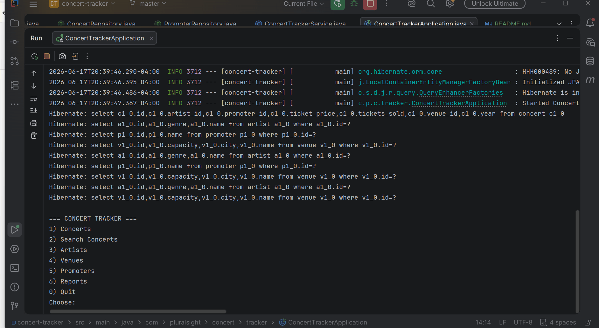

# Concert Tracker

## Description of the Project
Concert Tracker is a command-line application built for a live-music company to manage their shows. It allows back-office staff to keep track of venues, artists, promoters, and concerts. Users can add and manage all four types of data, search concerts by various filters, and generate reports that calculate revenue, capacity, and more. All data is stored in a MySQL database using Spring Boot and JPA.

## User Stories
- As a user, I want to list all concerts so that I can see every show in the system.
- As a user, I want to add a concert so that I can keep the catalog up to date.
- As a user, I want to search concerts by artist, venue, city, year, or price so that I can find specific shows quickly.
- As a user, I want to update a concert's ticket price and tickets sold so that the data stays accurate.
- As a user, I want to delete a concert, artist, venue, or promoter so that I can remove outdated records.
- As a user, I want to see a revenue report per venue so that I can track which venues make the most money.
- As a user, I want to see a capacity report so that I can tell which shows are sold out.
- As a user, I want to receive clear feedback so that I always know what the application is doing.

## Setup

### Prerequisites
- IntelliJ IDEA: Ensure you have IntelliJ IDEA installed, which you can download from [here](https://www.jetbrains.com/idea/download/).
- Java SDK 17: Make sure Java 17 is installed and configured in IntelliJ.
- MySQL: Make sure MySQL is installed and running on your machine.

### Running the Application in IntelliJ
1. Open IntelliJ IDEA.
2. Select "Open" and navigate to the directory where you cloned or downloaded the project.
3. After the project opens, wait for IntelliJ to index the files and set up the project.
4. Open MySQL and create a database called `concert_tracker`.
5. Update `src/main/resources/application.properties` with your MySQL username and password.
6. Find `ConcertTrackerApplication.java` and right-click it.
7. Select `Run 'ConcertTrackerApplication.main()'` to start the application.
8. Starter data will be seeded automatically on the first run.

## Technologies Used
- Java 17
- Spring Boot 3.5
- Spring Data JPA / Hibernate
- MySQL
- Maven

## Demo

## Future Work
- Add the ability to search promoters by the concerts they have run.
- Add a feature to export reports to a CSV file.
- Build a web-based front end using Spring MVC or React.
- Add user login and authentication for different staff roles.

## Resources
- Raymonds Git & Notes
- https://www.w3schools.com/java/

## Team Members
- **Brandon Parker** 

## Thanks
- Thank you For Raymond for being such an amazing teacher and explaining all concepts in detail. Also thank you to whoever is using my application!